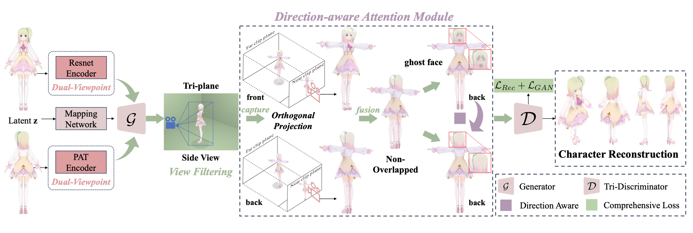

The overall pipeline of NOVA-3D. NOVA-3D utilizes front and rear viewpoint images as input. The dual-viewpoint encoder extracts features from the images, which are then used by the generator to produce two tri-planes. The tri-planes are sampled to obtain sampling features, and the direction-aware attention module is employed to fuse the features. Finally, the reconstruction loss and GAN loss modules are used to calculate the overall loss.

# Abstract 
In the animation industry, 3D modelers typically rely on front and back non-overlapped concept designs to guide the 3D modeling of anime characters. However, there is currently a lack of automated approaches for generating 3D character models directly from these 2D designs. In light of this, we propose to investigate a novel task of reconstructing 3D anime characters from non-overlapped views. Currently, there are two main challenges to this task. The first challenge is that existing multi-view reconstruction approaches, due to the absence of overlapping regions, are unable to directly apply to 3D reconstruction tasks. The second challenge is the lack of available full-body anime character data and standard benchmarks to support the task. To this end, we present NOVA-3D, a new framework for directly reconstructing full-body 3D anime characters from non-overlapped front and back views. On one hand, NOVA-3D implements an encoder for feature extraction at varying granularities, effectively enhancing the quality and detail expression of synthesized images. On the other hand, this framework allows viewpoint direction-adaptive feature fusion, enabling it to learn 3D-consistent features from non-overlapped views effectively. To realize the NOVA-3D framework, we collected the NOVA-Human dataset, which comprises multi-view images and accurate camera parameters for 3D anime characters. Extensive experiments demonstrate that the proposed method outperforms baseline approaches, successfully reconstructing anime characters with refined details and 3D consistency. In addition, in order to verify the effectiveness of our method, we applied it to the task of animation head reconstruction and achieved higher reconstruction quality than the baseline method.