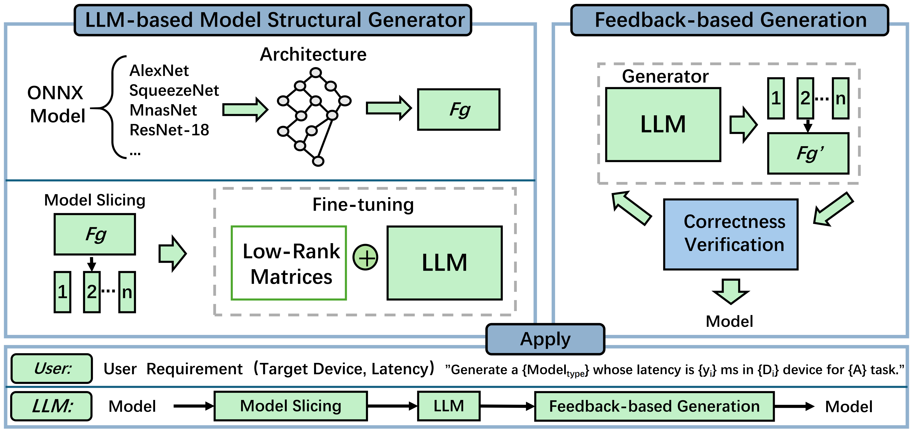

The pipeline of using LLM-AMG to generate deployable deep neural networks while meeting the latency constraint. 

# Abstract
LLM-based agents like HuggingGPT and Modelscope-agent are designed to coordinate multiple AI models for complex tasks, handling various data types such as text, images, and audio. This enables applications like video analysis, document summarization, and AI-assisted creativity. However, these systems mainly function in standardized cloud environments and struggle with the diverse hardware in IoT settings, where devices have varying capabilities. In this paper, we propose LLM-based Adaptive Model Generation (LLM-AMG), a framework that allows LLMs to design, refine, and optimize deep neural networks (DNNs) for deployment in heterogeneous IoT systems. We improve Large Language Models (LLMs) to understand AI model architectures by converting complex graph-based designs into structured text, making it easier for them to process graph data. To connect theoretical designs with real-world performance, we train LLMs to link architectural patterns (e.g., layer types, channel dimensions) with actual latency metrics on different edge devices. Since LLMs have limited memory, we introduce a token slicing technique to prevent information loss in long, multi-step tasks. To ensure the generated models are both accurate and practical, we refine them based on constraints like accuracy and latency. Additionally, we address the "existence illusion" problem using a feedback-driven optimization process. We evaluate LLM-AMG using public datasets and real IoT devices. The results show that our framework enables LLMs to autonomously design and adapt AI models for different deployment needs, making AI solutions more efficient and scalable for edge computing and IoT applications.