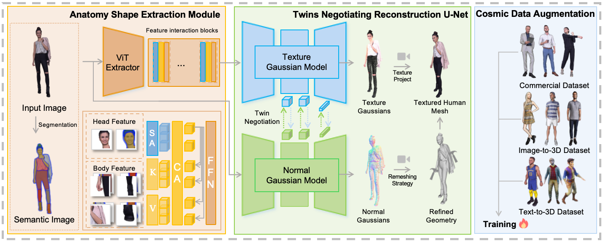

Our reconstruction method consists of three core components: the Anatomy Shaping Extraction (ASE) module, the Twins Negotiating Reconstruction (TNR) U-Net, and the Cosmic Data Augmentation strategy. It can directly predict a 3D human avatar from a 2D human image through one-time forward propagation of a single network . Specifically, we use the ASE module to extract implicit shape features based on the characteristics of human anatomy. In TNR, we construct two symmetric U-Nets to predict both texture and normal Gaussians. By allowing the features of these two U-Nets to interact, the reconstruction processes of the two modalities mutually enhance each other. Based on this specialized U-Net, we also propose an additional Gaussian Enhanced Remeshing strategy, using the generated normal Gaussian to help achieve a higher quality 3D human mesh. To leverage the scalability and ease of training of our model, we aim to further improve its performance, especially on out-of-distribution data. We propose a Cosmic Data Augmentation strategy that is based on the current developments in the 3D field and generates diverse human scans from image-to-3D and text-to-3D models.

# Abstract
Monocular 3D clothed human reconstruction aims to create a complete 3D avatar from a single image. To tackle the human geometry lacking in one RGB image, current methods typically resort to a preceding model for an explicit geometric representation. For the reconstruction itself, focus is on modeling both it and the input image. This routine is constrained by the preceding model, and overlooks the integrity of the reconstruction task. To address this, this paper introduces a novel paradigm that treats human reconstruction as a holistic process, utilizing an end-to-end network for direct prediction from 2D image to 3D avatar, eliminating any explicit intermediate geometry display. Based on this, we further propose a novel reconstruction framework consisting of two core components: the Anatomy Shaping Extraction module, which captures implicit shape features taking into account the specialty of human anatomy, and the Twins Negotiating Reconstruction U-Net, which enhances reconstruction through feature interaction between two U-Nets of different modalities. Moreover, we propose a Comic Data Augmentation strategy and construct 15k+ 3D human scans to bolster model performance in more complex case input. Extensive experiments on two test sets and many OOD cases show the superiority of our method over SOTA methods.
