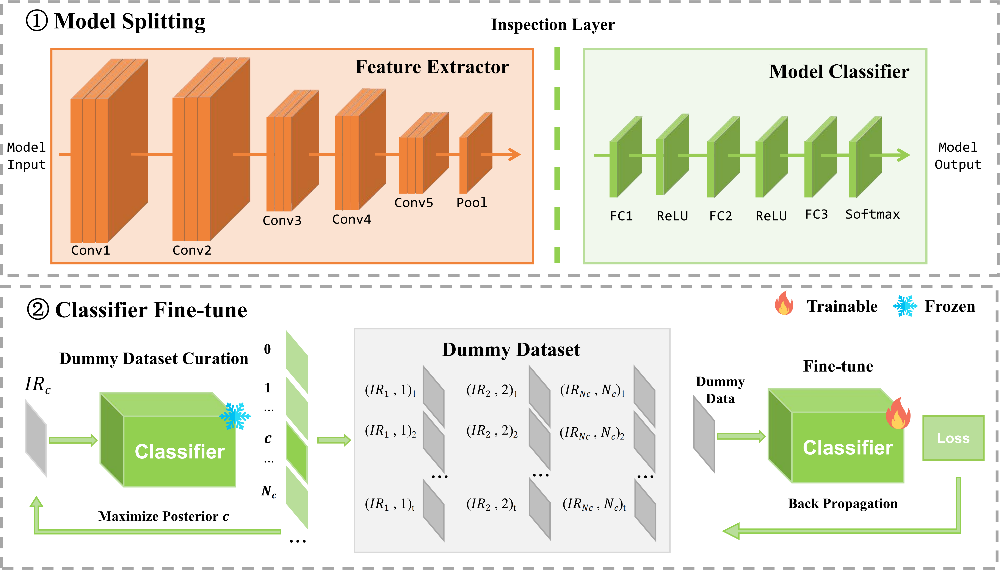

Illustration of our proposed DeepSanitizer. (1) The inspection layer divides the input trojaned model into two components: the feature extractor and the model classifier. (2) We use a gradient decent based algorithm to curate the dummy dataset and then utilize the generated dummy dataset to fine-tune the model classifier.

# Abstract
Deep Neural Networks (DNNs) are widely utilized in various Artificial Intelligent (AI) systems, such as face recognition, speech assistant, and autonomous driving. However, recent studies reveal DNN's vulnerability to backdoor attacks, also known as trojan attacks. A backdoored DNN makes wrong predictions when the input contains the trigger, which poses significant security threats to DNN-based AI systems. Existing backdoor removal methods often require access to clean validation samples or samples with the trigger. However, this may not be feasible in some real-world scenarios, such as when dealing with models from online platforms or federated learning environments. To bridge this critical gap, we propose DeepSanitizer, a novel approach based on our previous work, FreeEagle. DeepSanitizer effectively erases planted backdoors in DNNs, enabling mitigation of diverse backdoor attacks without the need for access to either clean or poisoned data.  Specifically, our method splits a compromised model into two components: the feature extractor and the model classifier via an introduced inspection layer. Then it utilizes a novel gradient-based algorithm to generate feature representations as the dummy data for fine-tuning the model classifier to remove the backdoor. Extensive experiments demonstrate that our approach effectively removes planted backdoors while maintaining the model performance, significantly outperforming state-of-the-art data-free and non-data-free backdoor mitigation techniques. Finally, DeepSanitizer reduces the defense time to just minutes, greatly faster than the existing methods.