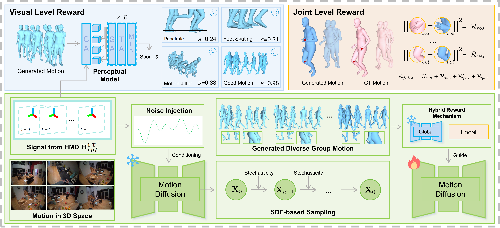

Given the input head trajectory signals $\mathbf{H}_{cpf}^{1:T}$ from HMD, we employ them as conditions for a motion diffusion model to recover human motion. To address low intra-group diversity, we obtain diverse motion outputs through SDE-based sampling and noise injection on trajectory conditions. Based on these outputs, we utilize a proposed hybrid reward mechanism for comprehensive reward calculation: at global visual level, a trajectory-conditioned perceptual model via spatial-temporal attention assesses visual plausibility; at the local joint level, we enforce explicit joint constraints to align generated results with GT. Finally, we calculate advantages and use GRPO to update the model parameters, providing guidance for both visual plausibility and joint accuracy.

# Abstract
This paper studies full-body 3D human motion recovery from head-mounted device signals. Existing diffusion-based methods often rely on global distribution matching, leading to local joint reconstruction errors. We propose MotionGRPO, a novel framework leveraging reinforcement learning post-training to inject fine-grained guidance into the diffusion process. Technically, we model diffusion sampling as a Markov decision process optimized via Group Relative Policy Optimization (GRPO). To this end, we introduce a hybrid reward mechanism that combines a learned conditioned perceptual model for global visual plausibility and explicit constraints for local joint precision. Our key technical insight is that policy optimization in diffusion-based recovery suffers from vanishing gradients due to limited intra-group sample diversity. To address this, we further introduce a noise-injection strategy that explicitly increases sample variance and stabilizes learning. Extensive experiments demonstrate that MotionGRPO achieves state-of-the-art performance with superior visual fidelity.